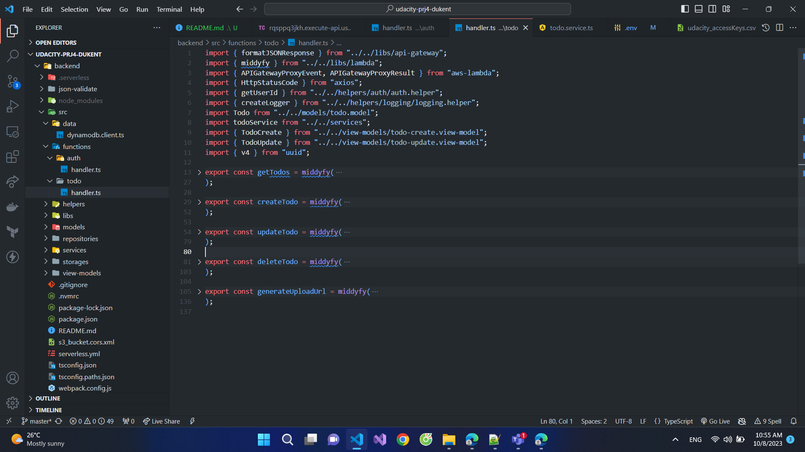

# Project: Cloud Capstone Project

This project is a simple "TODO" application using AWS Lambda and Serverless framework.

# Project Rubric Description

## Rubric 1: Functionality

### The application allows users to create, update, delete items
A user of the web application can use the interface to create, delete and complete an item.

### The application allows users to upload a file.
TODO: Chụp code upload s3 + ảnh phần upload S3 trên FE UI

### The application only displays items for a logged in user.
TODO: Chụp FE UI logged và unauthenticated user

### Tương tự chụp Unauthenticated user
TODO: Tương tự chụp Unauthenticated user

## Rubric 2: Codebase

### The code is split into multiple layers separating business logic from I/O related code.
TODO: Chụp lại cấu trúc source, mô tả layer nào, làm gì,...

### Code is implemented using async/await and Promises without using callbacks.
TODO: Chụp lại phần code async await.

## Rubric 3: Best practices

### All resources in the application are defined in the "serverless.yml" file.
TODO: Chụp file serverless.yml
### Each function has its own set of permissions.
TODO: Chụp trong file serverless dòng 159
### Application has sufficient monitoring.
TODO: Chụp trong file serverless + phần code logging + ảnh logs trên AWS cloud watch
### HTTP requests are validated.
Chụp ở trong serverless.yml (application/json: ${file(json-validate/todo-create-validator.json)})

## Rubric 4: 

### Data is stored in a table with a composite key.
TODO: Chụp trong file serverless.yml
### Scan operation is not used to read data from a database.
TODO: Chụp trong code phần GetTodos
