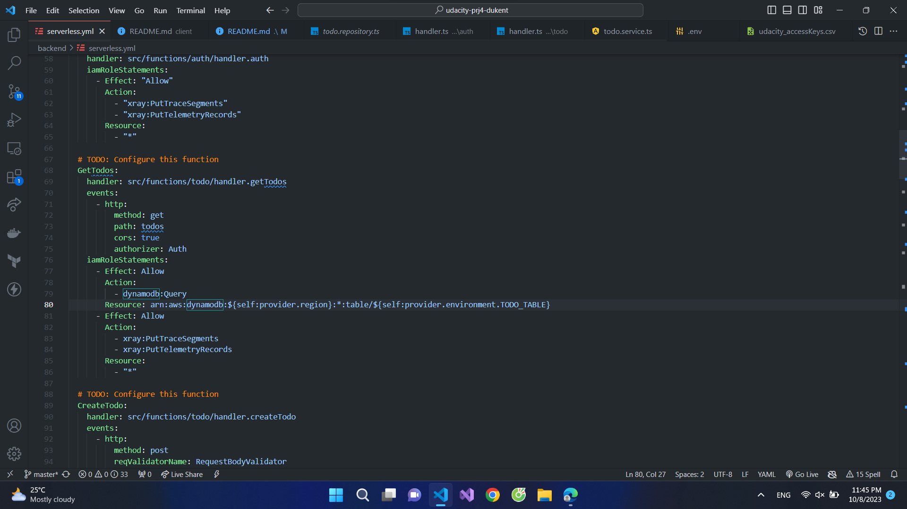
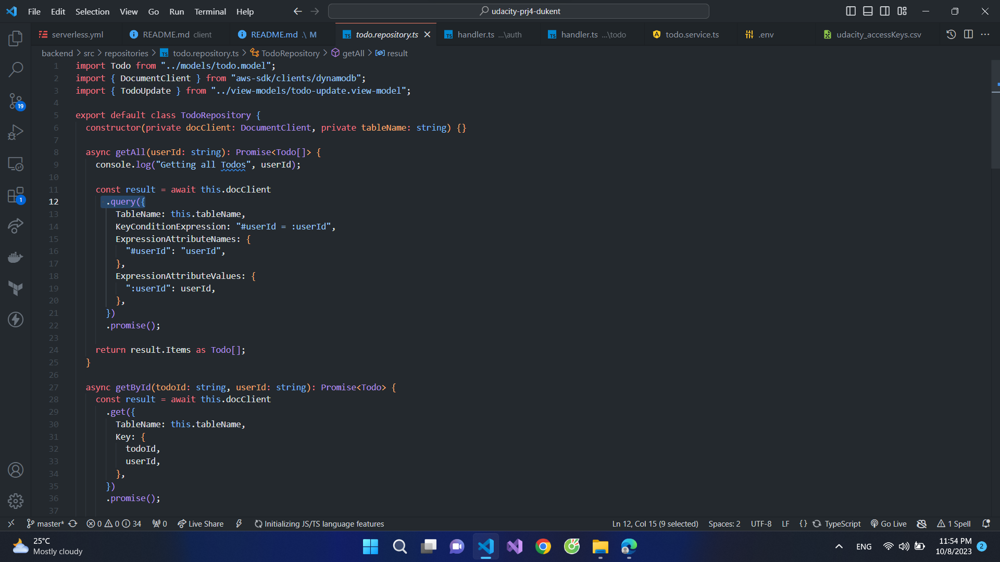

# Project: Cloud Capstone Project

This project is a simple "TODO" application using AWS Lambda and Serverless framework.

# Project Rubric Description
491959646282
## Rubric 1: Functionality

### The application allows users to create, update, delete items
A user of the web application can use the interface to create, delete and complete an item.
CRUD UI:

CRUD Backend handler:

### The application allows users to upload a file.
A user of the web interface can click on a "pencil" button, then select and upload a file. A file should appear in the list of items on the home page.
Upload file UI:

Files uploaded  are stored on S3:

File appear on Homepage:

### The application only displays items for a logged in user.
If you log out from a current user and log in as a different user, the application should not show items created by the first account.
- First user:

- Second user:

### Authentication is implemented and does not allow unauthenticated access.
A user needs to authenticate in order to use an application.
Authentication is handle in src/functions/auth/handler.ts and todo/handler.ts

## Rubric 2: Codebase

### The code is split into multiple layers separating business logic from I/O related code.
Code of Lambda functions is split into multiple files/classes. The business logic of an application is separated from code for database access, file storage, and code related to AWS Lambda.

### Code is implemented using async/await and Promises without using callbacks.
Using Async/Await:

## Rubric 3: Best practices

### All resources in the application are defined in the "serverless.yml" file.
All resources needed by an application are defined in the "serverless.yml". A developer does not need to create them manually using AWS console:

### Each function has its own set of permissions.
Instead of defining all permissions under provider/iamRoleStatements, permissions are defined per function in the functions section of the "serverless.yml":

### Application has sufficient monitoring.
Application has at least some of the following:
- Distributed tracing is enabled
- It has a sufficient amount of log statements
- It generates application level metrics

### HTTP requests are validated.
Incoming HTTP requests are validated either in Lambda handlers or using request validation in API Gateway. The latter can be done either using the serverless-reqvalidator-plugin or by providing request schemas in function definitions:

## Rubric 4: 

### Data is stored in a table with a composite key.
1:M (1 to many) relationship between users and items is modeled using a DynamoDB table that has a composite key with both partition and sort keys:

### Scan operation is not used to read data from a database.
Items are fetched using the "query()" method and not "scan()" method (which is less efficient on large datasets):

